# Daliy Stone

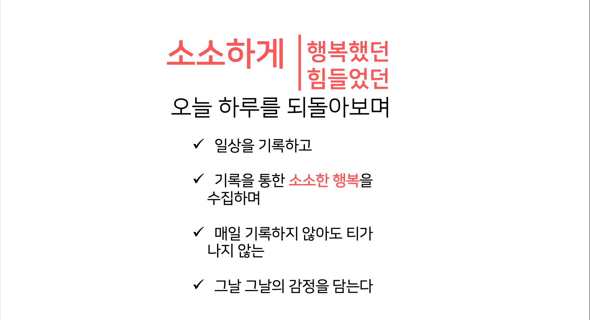

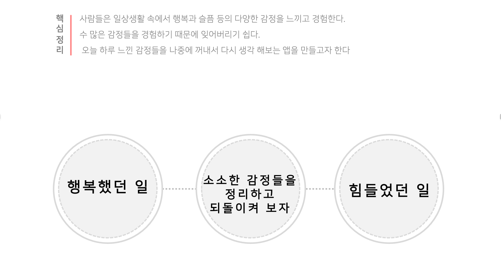

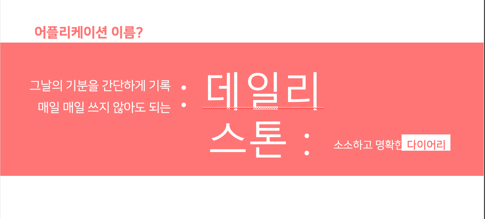

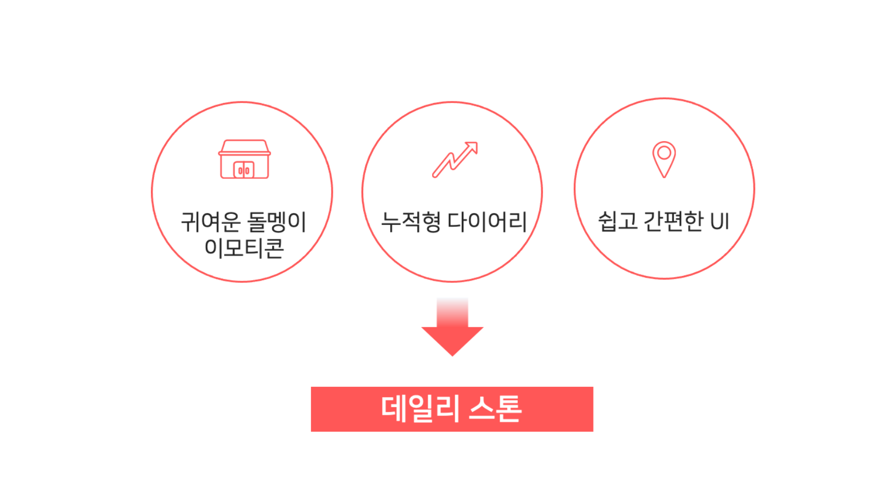

---
## **기능 소개**
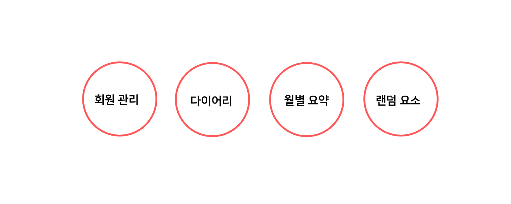

1. 로그인을 통한 회원 별 개개인의 다이어리 기능 구현
2. 다이어리 월별 요약을 통해 한눈에 볼 수 있도록 하는 요약 기능
3. 그날그날의 감정을 수치로 정하기 애매할 때 랜덤 다이스를 통해 정해주는 랜덤 기능

---
## **개발 방법**
- 사용자 회원가입, 로그인 계정 관리 : Google Firebase
- 스프린트, 프로덕트 백로그 작성 및 관리 : Trello
- 팀원 간 소통 방법 : Slack
- 사용 언어 : Kotlin
---
## **어플화면**

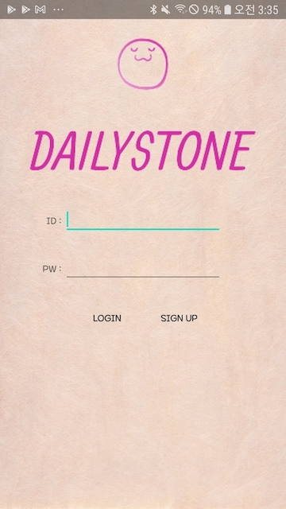
* 로그인 화면

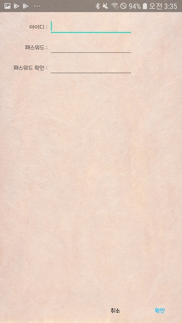
* 회원가입 화면.(계정 관리는 Google Firestore에서 하므로 이메일 형식이여야 함)

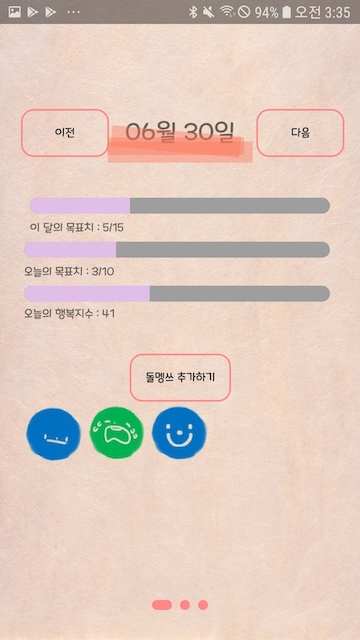
* 하루의 기분을 추가할 수 있는 화면
* 이달의 목표치 기본 설정은 15, 오늘 목표치 10으로 설정되어있고, 행복지수는 오늘 추가된 감정의 행복지수의 평균을 나타내준다.

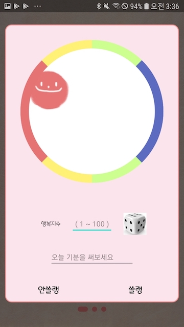
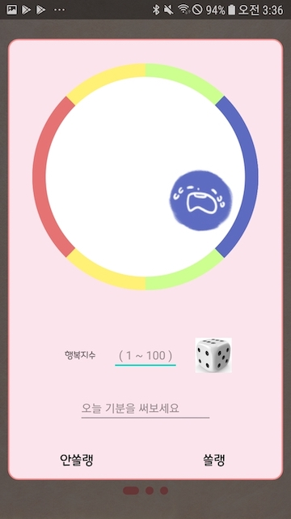
* '돌멩쓰 추가' 버튼을 누르면 나오는 화면.
* 원을 중심으로 위로 드래그하면 기분 좋은 것을 표시할 수 있는 이모티콘이, 아래로 드래그하면 기분이 좋지 않은 것을 표시할 수 있는 이모티콘이 나온다.
* 원 테두리의 색깔은 이모티콘의 색을 설정할 수 있다.
* 같은 각도라 해도 원의 중심에 가까우면 덜 슬프고, 원의 중심에서 멀어지면 매우 슬픈 이모티콘이 나온다.
* 오늘의 행복 지수를 1~100까지 숫자로 표현할 수 있으며 옆 주사위를 누를 시 랜덤한 수가 표출된다.
* 오늘의 기분을 한마디로 표현할 수 있다.

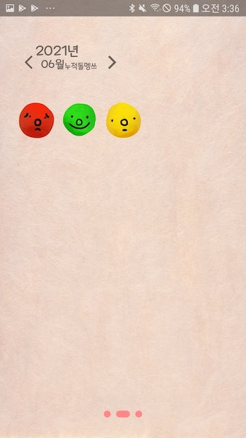
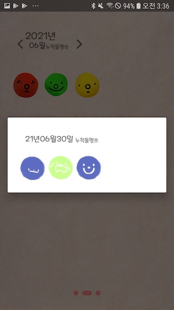
* 월별 누적된 돌멩쓰를 나타내는 화면
* 오늘의 행복지수 평균에 따라 일별로 0~30, 31~70, 71~100에 맞는 이모티콘이 존재한다.
* 이 화면에서 그 일자에 추가한 행복지수나 한마디를 확인할 수 있고, 수정도 가능하다.